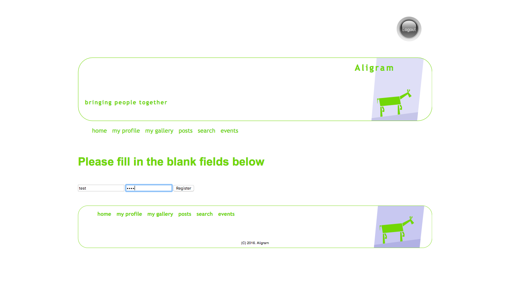
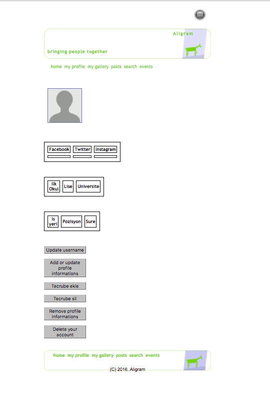
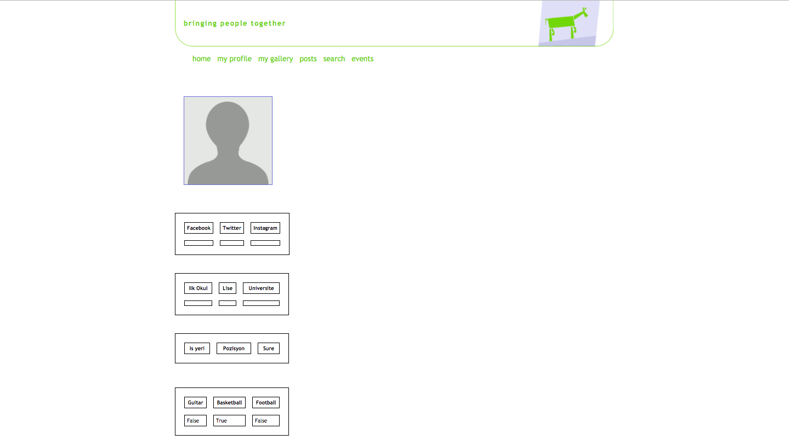
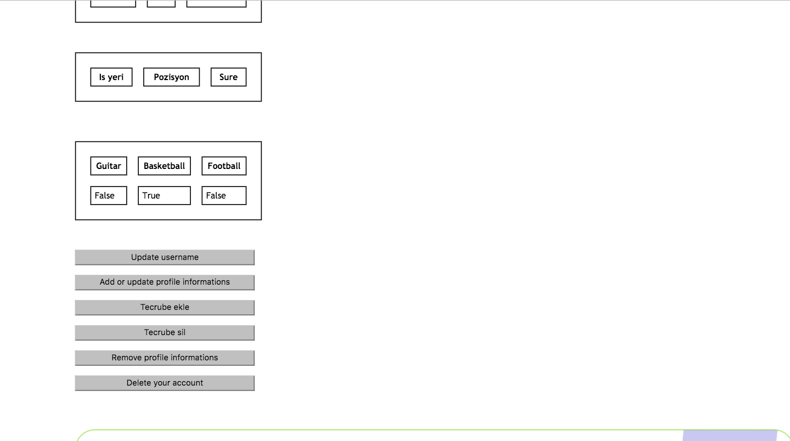

Parts Implemented by Kerim YILDIRIM
================================

Bu kısımda kullanıcı, sosyal hesap ve hobi işlemlerinin nasıl yapıldığı görsellerle birlikte anlatılacaktır.

Kullanıcı
------

Siteye ilk kez giriş yaptığımızda alttaki görseldeki sayfa bizi karşılıyor.

|H|

.. |H| image:: images/member1/login.png

Sistemde kayıtlı olmayan bir kullanıcı adıyla giriş yapmaya kalktığımızda sistem "Invalid credentials" hatası vermektedir. Yani kullanıcı bilgileri yanlış diye uyarıyor. Eğer bir kullanıcı oluşturmadıysak "register" butonuna tıklayarak kayıt sayfasına ulaşabiliriz. Kayıt sayfasının görseli alttadır. 

|H|

   
Bu safada kullanıcı ismimizi ve belirlediğimiz şifremizi girerek ilgili alanlara yeni bir kullanıcı oluşturabiliriz. Daha sonra da anasayfaya dönerek oluşturduğumuz kullanıcının bilgileriyle sisteme giriş yapabiliriz.

Giriş işlemimizi başarılı şekilde gerçekleştirdikten sonra "my profile" sekmesinden profil sayfamıza girebiliriz. Profil sayfamızın görünümünü alttaki görsel vasıtasıyla görebilirsiniz.

|H|

Profil sayfamıza biraz daha yakından bakalım. Profil sayfamızda iki tip öğe bulunuyor; profil fotoğrafımız ve çeşitli bilgilerimizin bulunduğu alanlar ve diğer öğeler ise değişik işlemler yapmamıza olanak sağlayan butonlardır. 

