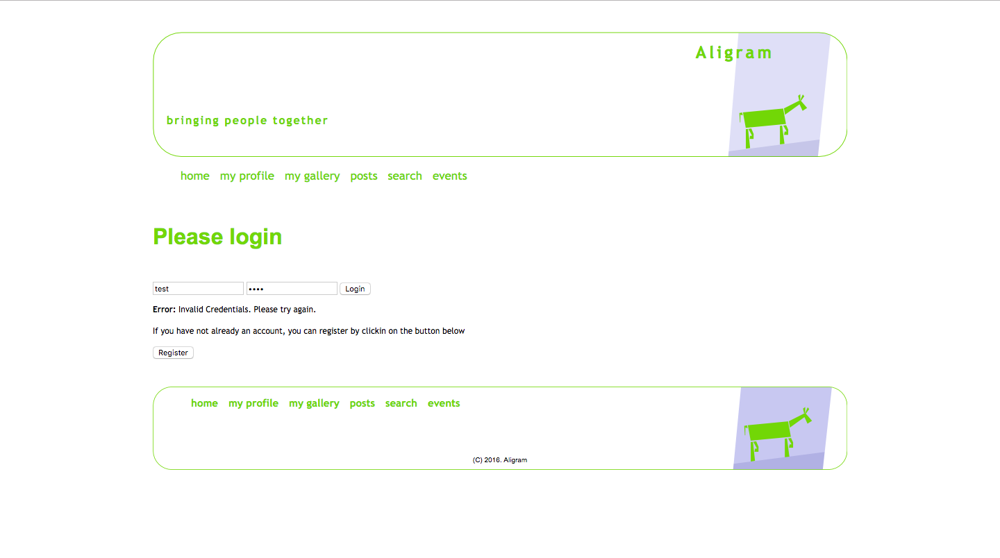
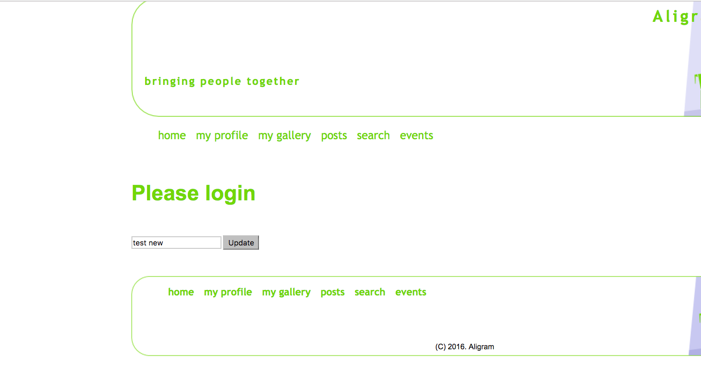
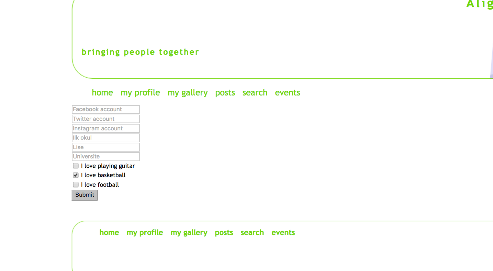
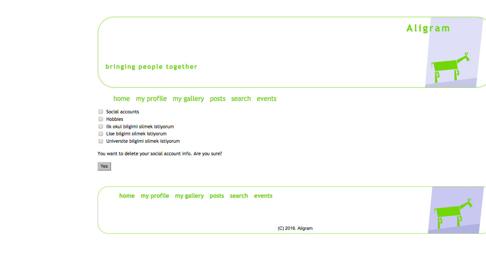
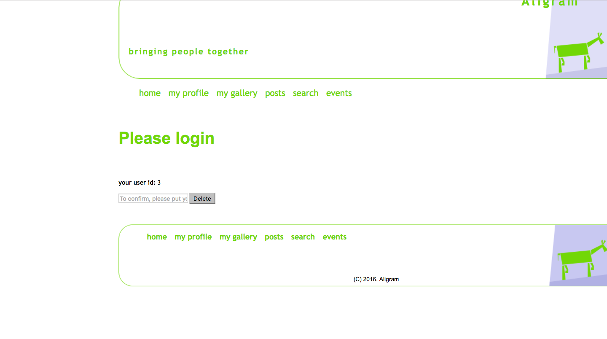
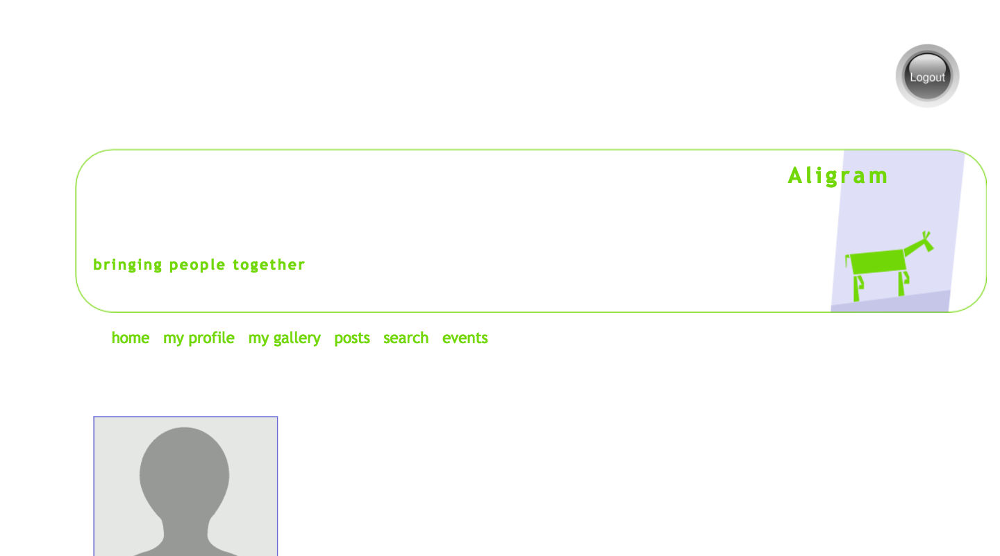

Parts Implemented by Kerim YILDIRIM
================================

Bu kısımda kullanıcı, sosyal hesap ve hobi işlemlerinin nasıl yapıldığı görsellerle birlikte anlatılacaktır.

Kullanıcı
------

Siteye ilk kez giriş yaptığımızda alttaki görseldeki sayfa bizi karşılıyor.

|I1|

.. |I1| image:: images/member1/login.png

Sistemde kayıtlı olmayan bir kullanıcı adıyla giriş yapmaya kalktığımızda sistem "Invalid credentials" hatası vermektedir. Yani kullanıcı bilgileri yanlış diye uyarıyor. 

|I2|

Eğer bir kullanıcı oluşturmadıysak "register" butonuna tıklayarak kayıt sayfasına ulaşabiliriz. Kayıt sayfasının görseli alttadır. 

|I3|

.. |I4| image:: images/member1/register_screen.png
   
Bu safada kullanıcı ismimizi ve belirlediğimiz şifremizi girerek ilgili alanlara yeni bir kullanıcı oluşturabiliriz. Daha sonra da anasayfaya dönerek oluşturduğumuz kullanıcının bilgileriyle sisteme giriş yapabiliriz.

Giriş işlemimizi başarılı şekilde gerçekleştirdikten sonra "my profile" sekmesinden profil sayfamıza girebiliriz. Profil sayfamızın görünümünü alttaki görsel vasıtasıyla görebilirsiniz.

|I5|

.. |I5| image:: images/member1/profile_page.png

Profil sayfamıza biraz daha yakından bakalım. Profil sayfamızda iki tip öğe bulunuyor; profil fotoğrafımız ve çeşitli bilgilerimizin bulunduğu alanlar ve diğer öğeler ise değişik işlemler yapmamıza olanak sağlayan butonlardır. 

Alttaki görsel vasıtasıyla profil sayfamızdaki alanlara yakından bakabilirsiniz.

|I6|

.. |I6| image:: images/member1/profile_page_1.png

Alttaki görsel vasıtasıyla ise çeşitli işlemler yapmamıza olanak sağlayan butonlara yakından bakabilirsiniz.

|I7|

.. |I7| image:: images/member1/profile_page_2.png

"update username" butonuna tıkladığımızda, site bizi kullanıcı adımızı değiştirebileceğimiz bir sayfaya yönlendirir ve alttaki görselde de görebildiğiniz üzere yeni bir kullanıcı adı girip "submit" butonuna bastığınıda kullanıcı isminiz değişecektir. 
Sistemde olan bir kullanıcı adı girdiğiniz zaman sistem hata mesajı gösterecektir ve talebinizi yerine getirmeyecektir.

|I8|

"Add or update profile informations" butonuna tıkladığınızda ise daha önceki görsellerde görmüş olduğunuz profilimizde bulunan alanlara bilgilerimizi girme imkanı bulacaksınız. Alttaki görseldeki sayfaya yönlendirileceksiniz ve oradan kolayca bilgi girişi yapabilirsiniz.

|I9|

Görseller ile ilgili kısım benim alanım olmadığı için profil fotoğraf ekleme mekanizmasını yapmadım.

"Remove profile informations" butonuna tıkladığınızda ise hangi tip bilgilerinizi silmek istediğinizi belirtip gerekli işlemlerin yapılması için komut verebileceğiniz bir sayfaya yönlendirileceksiniz. Bu yönlendirileceğiniz sayfanın görünümüne alttaki görselden ulaşabilirsiniz.

|I10|

Örneğin "Social accounts" alanına tick koyduğunuz zaman tüm sosyal hesap bilgileriniz silinecektir. Keza "Hobbies" alanına tick koyduğunuzda tüm hobi bilgileriniz silinecektir ve hobi ile ilgili kısım profil sayfanızda gözükmeyecektir. Tabi bu alanların birden fazlasına tick koyup submit butonuna basarak aynı anda birden fazla işlem yapma komutu verebilirsiniz.

"Delete your account" butonuna bastığınızda ise site sizi hesabınızı silebileceğiniz bir sayfaya yönlendirecektir. Bu sayfada güvenlik unsuru olarak ilgili giriş alanına "id" 'nizi girmeniz beklenecektir. id'yi doğru şekilde girdiğiniz takdirde hesabınız silinecektir. Sayfanın görünümüne alttaki görselden ulaşabilirsiniz.

|I11|

Son olarak ise eğer sisteme hali hazırda başarılı bir şekilde giriş yaptıysanız ve sitemizi kullandıktan sonra çıkmak istiyorsanız görselde de görülen sağ üst taraftaki "logout" görseline tıklayarak çıkış işlemini başarıyla gerçekleştirebilirsiniz. 

|I12|

