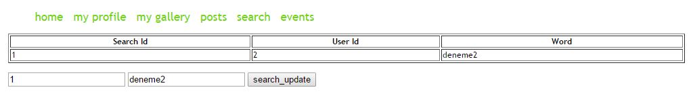

Parts Implemented by Ali KADAM
================================

Bu kısımda comment, search ve egitim geçmişi işlemlerinin nasıl yapıldığı görsellerle birlikte anlatılacaktır.

Search
------
Bu işlem için öncelikle search sayfasına giriyoruz ve aramak istediğimiz kelimeyi sağ taraftaki alana girerek search butonuna basıyoruz.

   *Resim 1: Search yapma
   
Daha sonra arama yaptığımız kelime arama yapan userın idsi ile birlikte ekranda gözükür.

.. figure:: images/member2/search_attıktan_sonraki_hal.JPG
   :scale: 75 %
   :align: center
   *Resim 2: Search yaptıktan sonraki durum
   
Searc tablosunda güncelleme yapmak için ise "Update Search" butonuna basarak güncelleme sayfasına geçiyoruz. Burada güncellemek istediğimiz
search satırının idsini ve yeni metini giriyoruz. Ardından "search_update" butonuna basıyoruz.

   *Resim 3: Search güncelleme
   
Silme işemi için ise  "Delete Search" butonuna basarak silme sayfasına geçiyoruz. Burada silmek istediğimiz
search satırının idsini giriyoruz. Ardından "search_delete" butonuna basıyoruz.

.. figure:: images/member2/search_delete.JPG
   :scale: 75 %
   :align: center
   *Resim 4: Search silme
   
Comment
-------
Bu işlem daha önce yapılmış bir posta yorum yapabilmek için tasarlandı. Öncelikle post sayfasından yapılan yönlendirmeyle comment
sayfasına geçiyoruz. Burada comment yapmak istediğimiz postun idsini ve yapacağımız yorumu giriyoruz.

   *Resim 5: Comment Atma
   
Bu işlem sonrasında commentimiz ekranda gözüküyor.

.. figure:: images/member2/posta_comment_2.JPG
   :scale: 75 %
   :align: center
   *Resim 6: Commentler
   

Bir commenti güncellemek için ise güncelleme sayfasına giderek güncellemek istediğimiz commentin idsini ve yeni yorumu giriyoruz.

   *Resim 7: Comment Güncelleme
   
 Silme işlemi için ise silme sayfasına gittikten sonra silmek istediğimiz commentin idsini giriyoruz.
 

   *Resim 8: Comment Silme
   
   
 Eğitim Geçmişi
 -------------- 
 Bu işlem kullanıcıların eğitim geçmişi bilgilerini girerek profil sayfasında gözükmesini sağlıyor. Kullanıcı "Add or Update Profil
 Information" butonuna basarak bu sayfaya gider ve ilgili kısımları doldurarak "Submit" butonuna basar.
 
 .. figure:: images/member2/egitim_ekleme.JPG
   :scale: 75 %
   :align: center
   *Resim 9: Eğitim Geçmişi Ekleme
   
Bu işlemden sonra kullanıcı eğitim geçmişi bilgilerini profil sayfasında görebilir.

.. figure:: images/member2/egitim_ekleme_sonuc.JPG
   :scale: 75 %
   :align: center
   *Resim 10: Eğitim Geçmişi Profil Sayfası
   
Eğitim geçmişinde güncelleme yapmak için tekrar "Add or Update Profil Information" butonuna basarak bu sayfaya gidiyoruz. Güncelleme
yapmak istediğimiz verinin bilgisini doldurup "Submit" butonuna basıyoruz. Aşağıda lise bilgisinin güncellenmesi gösterilmiştir.

.. figure:: images/member2/egitim_güncelleme.JPG
   :scale: 75 %
   :align: center
   *Resim 11: Eğitim Geçmişi Güncelleme
   
 
.. figure:: images/member2/egitim_güncelleme_sonuc.JPG
   :scale: 75 %
   :align: center
   *Resim 12: Eğitim Geçmişi Güncelleme Profil Sayfası Sonucu
   

Silme işlemi için ise "Remove Profil Information" butonuna basarak silme sayfasına gidiyoruz. Burada silmek istediğimiz bilgileri
seçerek "Yes" butonuna basıyoruz. Aşağıda ilkokul ve lise bilgilerinin silindiği bir örnek gösterilmiştir.

.. figure:: images/member2/egitim_silme.JPG
   :scale: 75 %
   :align: center
   *Resim 13: Eğitim Geçmişi Silme
   
 
.. figure:: images/member2/egitim_silme_sonuc.JPG
   :scale: 75 %
   :align: center
   *Resim 14: Eğitim Geçmişi Silme Profil Sayfası Sonucu
   
   
   

   

   
 
 
