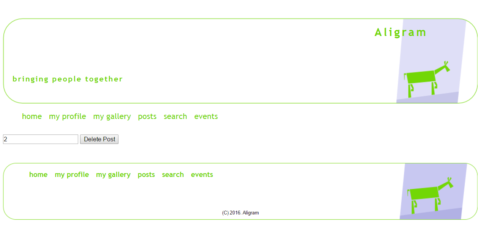

Parts Implemented by Muhammet Berhak Demir
================================

POSTLAR
----------------------

* Postsuz Ekran

Kullanıcı girişi yapıldıktan sonra Post sayfasına giriyoruz. Kullanıcının herhangi bir Post yapmadıysa sayfa şu şekilde gözüküyor:

|U2_1|

.. |U2_1| image:: images/member3/postsuz.PNG

*Resim 1: Postsuz Ekran

* Postlu Ekranlar

Kullanıcı sırasıyla postlar yaptığında post sayfası örnek olarak şu şekilde gözüküyor:

|U2_2|

      
*Resim 2: Postlu Ekran-1     
      
|U2_3|

*Resim 3: Postlu Ekran-2

* Post İçin Update İşlemi

Kullanıcı önceden yapmış olduğu Postu güncelleyebilir:

|U2_4|

*Resim 4: Post Güncellemesi-1

Post sayfası şu şekilde güncellenmiş olur:

|U2_5|

      
*Resim 5: Post Güncellemesi-2    

* Post İçin Delete İşlemi

Kullanıcı önceden yapmış olduğu Postu silebilir:

|U2_6|

*Resim 6: Post Silinmesi-1

Post sayfasında son hal şu şekilde olur:

|U2_7|

*Resim 7: Post Silinmesi-2

İŞ TECRÜBELERİ
----------------------

* İş Tecrübeleri Ekranı

Kullanıcı girişi yapıldıktan sonra Profile sayfasına giriyoruz. Kullanıcını ile ilgili bir çok bilgi bu sayfada mevcut. Bu bilgilerden 
bir tanesi de kazanmış olduğu iş tecrübeleri. İş tecrübesini yazmamış bir kullanıcının sayfası şu şekilde gözüküyor:

|U2_8|

*Resim 8: İş Tecrübesi Ekranı
      
Kullanıcı yeni bir tecrübe eklemek istediğinde "tecrübe ekle" butonuna tıkladıktan sonra çıkan ekrana bilgilerini şu şekilde girer:

|U2_9|

.. |U2_9| image:: images/member3/tecrube.PNG

*Resim 9: Tecrübe Ekleme Ekranı

Kullanıcının profil sayfası şu şekilde güncellenmiş olur:

|U2_10|

*Resim 10: Eklenmiş İş Tecrübesi

* İş Tecrübeleri Güncelleme

Kullanıcı yeni bir iş tecrübesi eklemek istediğinde yine "tecrübe ekle" butonuna bastıktan sonra bilgilerini girebilir. Yeni bilgiler 
yazıldığında profil sayfası da güncellenir:

|U2_11|

*Resim 11: Güncellenmiş İş Tecrübesi

* İş Tecrübeleri Silme

Kullanıcı önceden girmiş olduğu iş tecrübesini silmek için "tecrübe sil" butonuna tıkladıktan sonra çıkan ekrana işyerinin ismini girer:

|U2_12|

*Resim 12: Tecrübe Silme Ekranı

      
Kullanıcı sileceği işyerinin ismini girdikten sonra o iş tecrübesi profil sayfasından kaldırılır:

|U2_13|

*Resim 13: Silinmiş İş Tecrübesi

    
