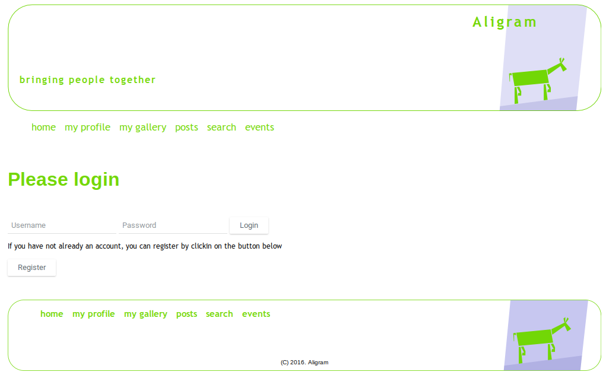
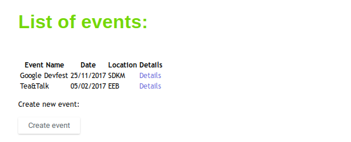
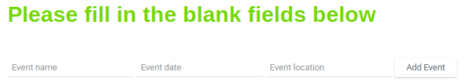
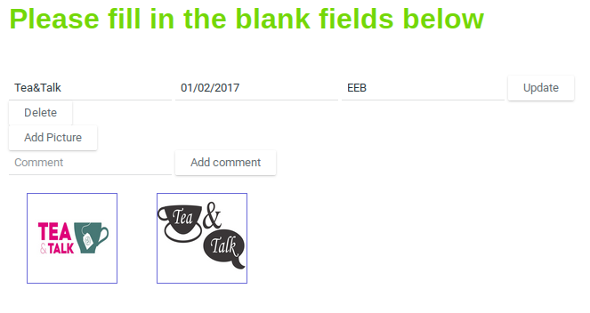
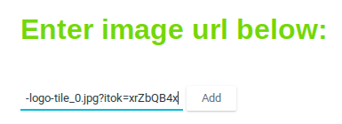
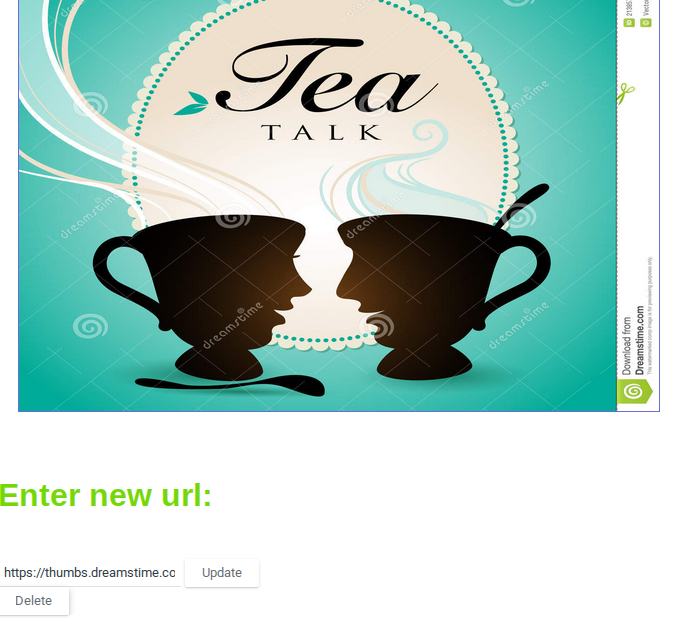
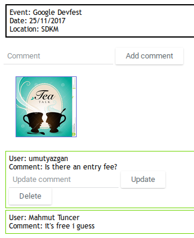

Umut Yazgan Tarafından Eklenen Kısımlar
================================

Events Sayfası
--------------

Kullanıcılar bu sayfa aracılığı ile event(etkinlik) oluşturabilir, düzenleyebilir ve oluşturulan event'leri görüntüleyebilirler.

   
   *Resim 1: events sayfasına sitenin üst ve alt menülerinin en son bağlantısından erişilebilir.*
   
Sayfaya ilk girildiğinde kullanıcı açılmış olan event'lerin bir listesini görür. Eğer kullanıcı giriş yaptıysa "Create Event" butonuna tıklayarak kendi event'ini oluşturabilir. Misafir kullanıcılar bu butonu göremez, event oluşturamaz.
   

   
   *Resim 2: İki event eklendikten sonra "events" sayfasının giriş yapmış kullanıcı gözünden görünümü.*
   
Giriş yapmış kullanıcı "Create Event" butonuna tıkladığı zaman event oluşturma sayfasına yönlendirilir. Bu sayfada event'in adını, zamanını ve konumunu girip "Add Event" butonuna tıklayarak event oluşturulabilir.

   
   *Resim 3: event ekleme sayfası*
   
events sayfasında listelenen event'lerden birinin sağındaki "Details" bağlantısına tıkladığı takdirde kullanıcı o event'in sayfasına yönlendirilir. Burada event'i oluşturan kullanıcı "Delete" butonuna tıklayarak event'i silebilir veya event'in bilgilerini yeniden girip "Update" butonuna tıklayarak event'i güncelleyebilir. Diğer kullanıcılar ise yalnızca event'i görüntüleyebilir.

   
   *Resim 4: event'i oluşturan kişinin gözünden event'in sayfası*
   
Event'e Görsel Ekleme
---------------------

event'i oluşturan kişi "events" sayfasında kendi event'inin sağındaki "Details" bağlantısına tıklayarak event'in sayfasına ulaştıktan sonra burada "Add Picture" butonuna tıklayarak event'in görsel ekleme sayfasına ulaşabilir. Diğer kullanıcılar bu butonu göremez ve bu sayfaya ulaşamaz. Bu sayfada görselin URL'si girilerek "Add" butonuna tıklandığında görsel event'e eklenecektir. Eklenen görsel event'in sayfasında tıklanabilir bir küçük görsel olarak görünür.

   
   *Resim 5: event'e görsel ekleme sayfası*
   
Görsel eklendikten sonra event'in sayfasındaki küçük görsele tıklanarak görselin sayfasına ulaşılabilir. Bu sayfada görselin daha büyük boyutlu bir hali mevcuttur. Eğer event'i oluşturan kişi bu sayfaya girerse görseli silmek için bir "Delete" butonu ile beraber güncellemek için yeni URL girebileceği bir kutu ve bir "Update" butonu görecektir.

   
   *Resim 6: event'i ekleyen kişi gözünden eklediği bir görselin sayfası*
   
Event'e Yorum Ekleme
--------------------

Kullanıcı herhangi bir event'in sayfasında "Comment" kutusuna yorumunu girip "Add Comment" butonuna tıklayarak event'e yorum ekleyebilir. Yorum yapabilmek için giriş yapmış olmak gereklidir, misafir kullanıcılar bu yorum kutucuğunu ve "Add Comment" butonunu göremezler.

Yorumu yazan kullanıcı yorumunun altındaki "Update" ve "Delete" butonlarını kullanarak yorumunu düzenleyebilir veya silebilir. Her kullanıcı bu işlemleri ancak kendi yorumları üzerinde yapabilir, kullanıcılar birbirlerinin yorumlarına müdahalede bulunamazlar.

   
   *Resim 7: iki farklı kullanıcının bir event'e yaptığı yorumlar*
